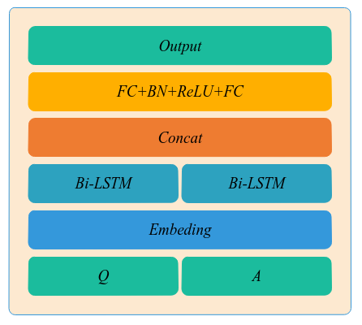
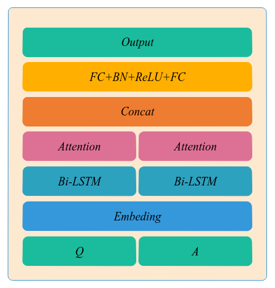

# 智能阅读模型的构建

## 构建流程
总体分为两部分：第一部分粗匹配相似句子，第二部分对候选回答排序，选择置信度最高的正确回答。

第一部分可使用 TF-IDF、LSI 等传统方法。

第二部分可使用 基于深度学习的问答系统。

本文主要构建第二部分，第一部分可参考：https://github.com/littleredhat1997/doc-similarity

## 下载数据

1. http://www.tipdm.org/jingsa/1253.jhtml  
(train_data_complete.json/test_data_sample.json/submit_sample.txt)=> main/data

2. https://spaces.ac.cn/archives/4338  
(me_train.json => generalization/data)

## 运行项目
```
run:
word2vec/step.ipynb -> word2vec/word2vec.ipynb -> 
main/data/data.ipynb -> main/data/1\_2\_3\_4\_5xxxxxx.ipynb -> main/evaluate.ipynb -> 
test/data/newdata.ipnb -> test/data/data.ipynb -> test/predict.ipynb -> test/evaluate.ipynb

tree
.
├── word2vec
│   ├── step.ipynb
│   └── word2vec.ipynb
├── main
│   ├── data
│   │   └── data.ipynb
│   ├── 1_FastText.ipynb
│   ├── 2_CNN1.ipynb
│   ├── 3_CNN2.ipynb
│   ├── 4_BiLSTM.ipynb
│   ├── 5_Attention.ipynb
│   └── evaluate.ipynb
└── test
    ├── data
    │   ├── data.ipynb
    │   └── newdata.ipynb
    ├── evaluate.ipynb
    └─── predict.ipynb

```

## 模型设计
1. FastText


2. CNN


3. Bi-LSTM



4. Attention



```
在进行模型训练之前，需要将问题和回答转换为对应的词向量。以
问题：“'射雕英雄传中谁的武功天下第一”
回答：“王重阳武功天下第一”
为例，生成一个词向量具体步骤如下所示：
①分词 (Cut)：
>>> ['射雕 英雄传 中 谁 的 武功 天下第一', '王重阳 武功 天下第一']
分词采用 Python 自然语言处理工具 jieba。开发者可以指定自己自定义的词典，以便包含 jieba 词库里没有的词。虽然 jieba 有新词识别能力，但是自行添加新词可以保证更高的正确率。
②字典化 (Tokenizer)：
>>> {'中': 5, '天下第一': 2, '射雕': 3, '武功': 1, '王重阳': 8, '的': 7, '英雄传': 4, '谁': 6}
将分词后的词语编号，映射到一个数字，用以标识这个词语。
③序列化 (Sequences)：
>>> [[3, 4, 5, 6, 7, 1, 2]]
	>>> [[8, 1, 2]]
将一个句子中的词语序列化成词向量列表。
④填充字符 (Padding)：
>>> [[0 0 0 3 4 5 6 7 1 2]]
>>> [[0 0 0 0 0 0 0 8 1 2]]
深度学习的输入数据为固定长度，因此需要对序列进行填充或截断操作。小于固定长度的序列用 0 填充，大于固定长度的序列被截断，以便符合所需的长度。
```
